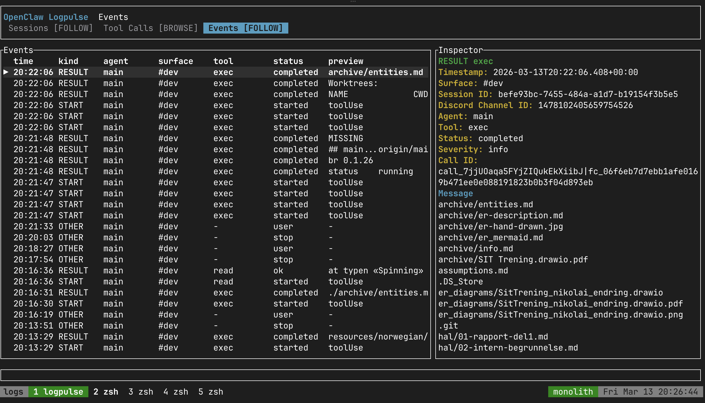
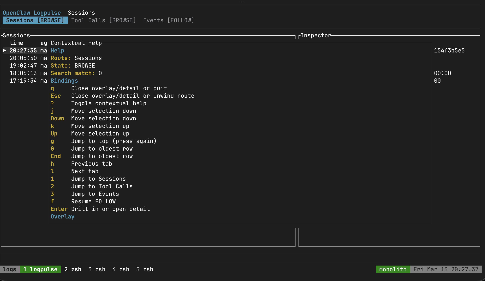

# logpulse

logpulse gives you a fast CLI for live OpenClaw log observation focused on tool-call lifecycle visibility.

By default, it now launches a color TUI dashboard for humans. If stdout is not a terminal, it automatically falls back to line-oriented human output so pipes and scripts still behave.

## Screenshots

**Events view** — live tool-call lifecycle with inspector panel:



**Sessions view** — active sessions with contextual help overlay:



## Install

```bash
# Install globally from source
cd /home/anders/.openclaw/workspace/dev/openclaw-logpulse
cargo install --path .
```

`cargo install` places the binary in `~/.cargo/bin`. If that directory is not already on your shell `PATH`, add it:

```bash
echo 'export PATH="$HOME/.cargo/bin:$PATH"' >> ~/.zshrc
source ~/.zshrc
```

## Update

After pulling repo changes, reinstall the binary globally:

```bash
cd /home/anders/.openclaw/workspace/dev/openclaw-logpulse
git pull
cargo install --path . --force
```

Use `--force` so the installed binary is replaced even when the package version in `Cargo.toml` has not changed.

## Usage

```bash
# Default: launch the TUI; it auto-starts the collector while following
logpulse

# Run the collector explicitly (useful for services or manual debugging)
logpulse daemon

# Launch the TUI without restoring persisted history for this run
logpulse tui --fresh

# One-shot backfill of discovered sources into the SQLite store
logpulse daemon --no-follow

# Filter the TUI by session, agent, and tool
logpulse --session "session-12" --agent "agent-7" --tool shell

# Force line-oriented human output
logpulse --format human

# JSON output for machine ingestion
logpulse --format json

# One-line with explicit log file path
logpulse /var/log/openclaw.log

# Optional time window + heartbeat/stale controls
logpulse --since 2026-01-01T12:00:00Z --until 2026-01-02T12:00:00Z \
  --stale-seconds 20 --heartbeat-seconds 5

# One-shot parse (no follow)
logpulse --no-follow

# Delete the persisted TUI history store
logpulse tui clear
```

### Arguments

- `[LOG_FILE]` optional path to OpenClaw log file. Omit for auto-discovery.
- `--session <SUBSTRING>` show only events matching session key substring.
- `--tool <NAME>` filter by tool substring (case-insensitive).
- `--agent <SUBSTRING>` filter by agent id substring (case-insensitive).
- `--min-level <trace|debug|info|warn|error|fatal>` minimum level filter.
- `--format <tui|human|json>` output format (`tui` is the interactive default for terminals).
- `--since <TIMESTAMP>` emit events at or after this time (`RFC3339` or unix seconds).
- `--until <TIMESTAMP>` emit events at or before this time (`RFC3339` or unix seconds).
- `--stale-seconds N` threshold for stale in-flight calls.
- `--heartbeat-seconds N` heartbeat cadence.
- `--poll-millis N` file poll interval used when following.
- `--from-start` start from file start.
- `--no-follow` read existing content only.
- `--fresh` skip restoring persisted TUI history for this run. `logpulse tui --fresh` is the explicit TUI form.
- `daemon` run the collector explicitly. The TUI auto-starts this collector while following, so new rows keep arriving even though rendering is database-backed.
- `tui clear` delete the persisted TUI history store at `~/.openclaw/logpulse/history.sqlite3`.

### TUI controls

- `q` quit
- `Esc` go back through detail, scoped drilldowns, and overlays
- `1`/`2`/`3` jump to Sessions, Tool Calls, and Events
- `h`/`l` move between tabs
- `↑/↓` or `j/k` move through the current table; manual movement enters BROWSE
- `Enter` drill in from Sessions → Tool Calls → Events, then open detail
- `o` open fullscreen detail from Events
- `f` resume FOLLOW for the active tab
- `gg` jump to newest row, `G` jump to oldest retained row
- `PgUp`/`PgDn` scroll fullscreen detail and help
- `p` open preset operations; `1` Live, `2` Stale, `3` Errors, `4` System, `5` Recent 15m
- `/` search visible rows; `Enter` applies, `Esc` cancels, empty search clears
- `s` toggle stale-only mode
- `?` toggle contextual help

The dashboard is organized as an ops cockpit: Sessions show call health and source state separately, Tool Calls show correlation confidence plus compact call IDs, and Events keep call IDs visible beside tool/status previews. The inspector still shows decoded event metadata plus a pretty-printed raw payload when you need the full record.

The TUI restores up to the newest 10,000 normalized events from a global SQLite history store and polls that store for updates. When following discovered sources, it starts the collector daemon automatically so new events keep arriving even while rendering stays database-backed. Use `logpulse tui clear` to wipe that store; in-TUI filtering and presets remain viewport-only and do not delete persisted history.

Auto-discovery scans `~/.openclaw/agents/*/sessions` and nested
`~/.openclaw/agents/*/agent/*/sessions/**` trees for OpenClaw and Codex transcript files:

- active `<session-id>.jsonl` files
- reset archives named `<session-id>.jsonl.reset.<timestamp>`
- deleted archives named `<session-id>.jsonl.deleted.<timestamp>`
- Codex `rollout-*.jsonl` files

It ignores `sessions.json`, lock files, trajectory sidecars, and unrelated JSONL.

## Discord Channel Names

Discord channel-name resolution checks the live Discord API first. Set one of these env vars to enable that lookup:

- `LOGPULSE_DISCORD_TOKEN`
- `DISCORD_TOKEN`
- `DISCORD_BOT_TOKEN`

If the live lookup is unavailable or a channel is inaccessible, logpulse can fall back to a local JSON map stored outside the repo at `~/.openclaw/logpulse/discord_channels.json`.

- Override the fallback-file path with `LOGPULSE_DISCORD_CHANNEL_MAP_FILE`.
- If the fallback file is missing, logpulse behaves as if no local overrides are configured.
- The fallback file must be a JSON object mapping Discord channel IDs to channel names.

Example shape:

```json
{
  "123456789012345678": "main",
  "234567890123456789": "research"
}
```

A sanitized example file lives at `docs/examples/discord_channels.json`.

## Troubleshooting

- If auto-discovery fails, pass a log path directly and confirm permissions: `logpulse <LOG_FILE>`.
- If malformed lines dominate, check that the log source format changed; non-JSON lines are preserved as MALFORMED events.
- If stale warnings flood, verify tool call completion markers are present in the log (`...tool_call_result...` or structured result fields).
- If heartbeat never appears, verify events are being emitted and/or inspect no-follow mode behavior.
